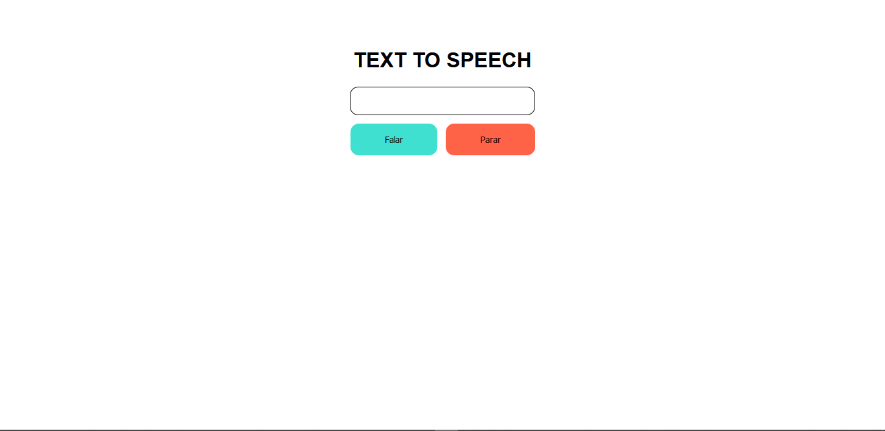

# 🎙️😱 Text To Speech 😱🎙️

## Caso tenha preguiça para ler algum texto, é so colar o texto e ele será lido automagicamente 😱

    

### Caso queira acessar o projeto em tempo real clique [aqui](https://jpbrab0.github.io/text-to-speech/)

## Compatibilidade

|Navegadores|Compativel|
|:--: | :---: |
|Chrome|✔️|
|Firefox|✔️|
|Microsoft Edge|✔️|
|Internet Explorer|❌|
|Opera|❓|
|Safari|✔️|

 __Feito por [João Pedro Resende](https://jpres.dev)__